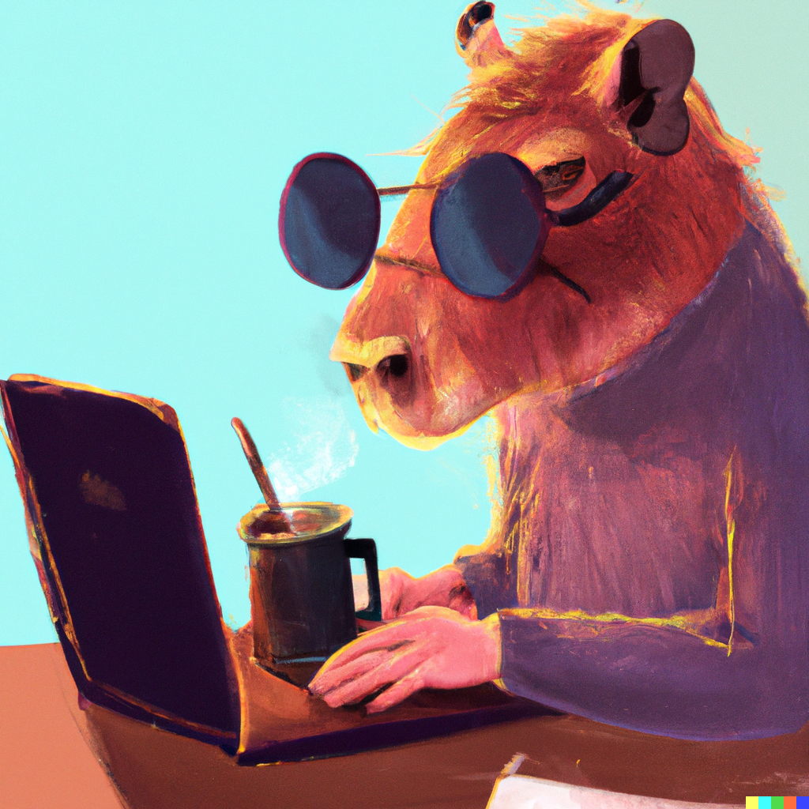

# Un review de DALLE-2
Un repo con links, ideas, comentarios, y otras cosas lindas sobre DALLE-2 y parecidos.

`Disclaimer: Este review se va a quedar muy corto y muy obsoleto, muy rápido.` 

## Empezando por algún lado: Qué es DALLE-2?

[Un repo de OpenAI](https://github.com/openai/dalle-2-preview/blob/main/system-card.md) nos da algo de información técnica sobre DALLE-2 además de contarnos que es lo que piensan sobre contenido explícito, sesgos y representaciones de diversidad, bullying, desinformación, derechos de autor, etc.

> ## Model 

> DALL·E 2 is an artificial intelligence model that takes a text prompt
and/or existing image as an input and generates a new image as an
output. DALL·E 2 was developed by researchers at OpenAI to understand
the capabilities and broader implications of multimodal generative
models. In order to help us and others better understand how image
generation models can be used and misused, OpenAI is providing access to
a subset of DALL·E 2's capabilities[^1] via the DALL·E 2 Preview.

> DALL·E 2 builds on [DALL·E 1](https://openai.com/blog/dall-e/)
([Paper](https://arxiv.org/abs/2102.12092) \| [Model
Card](https://github.com/openai/DALL-E/blob/master/model_card.md)),
increasing the level of resolution, fidelity, and overall photorealism
it is capable of producing. DALL·E 2 is also trained to have new
capabilities compared to DALL·E 1.

> ## Model capabilities

> In addition to generating images based on text description prompts
("Text to Image"), DALL·E 2 can modify existing images as prompted using
a text description ("Inpainting"). It can also take an existing image as
an input and be prompted to produce a creative variation on it
("Variations").

> ## Model training data

> DALL·E 2 was trained on pairs of images and their corresponding captions. Pairs were drawn from a combination of publicly available sources and sources that we licensed.

> We have made an effort to filter the most explicit content from the
training data for DALL·E 2.[^2] This filtered explicit content
includes graphic sexual and violent content as well as images of some
hate symbols.[^3] The filtering was informed by but distinct from
earlier, more aggressive filtering (removing all images of people) that
we performed when building
[GLIDE](https://arxiv.org/abs/2112.10741), a distinct model that
we published several months ago. We performed more aggressive filtering
in that context because a small version of the model was intended to be
open sourced. It is harder to prevent an open source model from being
used for harmful purposes than one that is only exposed through a
controlled interface, not least due to the fact that a model, once open
sourced, can be modified and/or be combined with other third party
tools.[^4]

### Resultados

|   |   |
|---|---|
  |  
`a colourful self-portrait illustration of a cute capybara drinking 🧉 mate and working on a laptop as a programmer wearing sunglasses on a light background`  |  `A capybara drinking yerba mate as the explosion of a nebula's star`
  |  
`An illustration of a Capybara as the best President of Argentina surrounded by happy crowd in Buenos Aires City, digital art`  |  `A panorama photo of a Capybara wearing dark glasses and programming the solution to all problems the Argentine economy faces at the moment, in the style of Blade Runner 2049`
  |  
`A man dressed up as Batman is being interviewed after a car crash during the evening in a sensationalist and melodramatic coverage by an Argentine TV channel`  |  `A psychedelic self-portrait illustration of a corgi as working on a laptop as a programmer wearing sunglasses on a dark background, trending artstation`

### Tipos de modelos generativos

[Mia Tang](https://www.mia-tang.com/about) hizo unas excelentes ilustraciones sobre distintos modelos


### Introducción al arte multi-modal hecha por un tipo buena onda

[](https://www.youtube.com/watch?v=K2lA2WxhLnw)

### Cómo es el proceso de crear una imagen?

En [este thread de Twitter](https://twitter.com/amli_art/status/1549555688304623617), el usuario @amli_art explica como es su proceso creativo y técnico para generar una imagen, enfocándose mas que nada en "prompt engineering" o como elegir el texto correcto para generar una nueva imagen. No son los únicos [tips](https://twitter.com/davidad/status/1551143240065228800) sobre lo mismo.

[Guy Parsons](https://twitter.com/GuyP), siguiendo por ese lado, ha [publicado un libro llamado "DALLE-2 Prompt Book"](https://twitter.com/GuyP/status/1547234780001042432) donde nos da una excelente guia de como escribir buenos prompts para muchos (muchísimos) casos de uso y también una buena intro a las distintas funcionalidades de DALLE-2. Altamente recomendable tenerlo siempre a mano

> The book also explains all the basic DALL·E techniques, like:

> - 🔀 merging multiple images
> - 🌅 creating landscape, portrait + mural-sized images
> - 👀 fixing details with inpainting
> - 🖼 uncropping and 'zooming out'


### "Do models like DALL-E 2 get basic relations (in/on/etc)?"

Colin Conwell y Tomer Ullman lo investigaron y encontraron un par de cosas interesantes

> Relations are basic building blocks of human cognition. Classic and recent work suggests that many relations are early developing, and quickly perceived. Machine models that aspire to human-level perception and reasoning should reflect the ability to recognize and reason generatively about relations. We report a systematic empirical examination of a recent text-guided image generation model (DALL-E 2), using a set of 15 basic physical and social relations studied or proposed in the literature, and judgements from human participants (N = 169). Overall, we find that only ~22% of images matched basic relation prompts. Based on a quantitative examination of people's judgments, we suggest that current image generation models do not yet have a grasp of even basic relations involving simple objects and agents. We examine reasons for model successes and failures, and suggest possible improvements based on computations observed in biological intelligence.

> resumen: https://twitter.com/TomerUllman/status/1554450808569319425
> abs: https://arxiv.org/abs/2208.00005


### Todo muy lindo, pero cúanto sale?

Sacado de [la página de OpenAI](https://openai.com/blog/dall-e-now-available-in-beta/)

> In this first phase of the beta, users can buy additional DALL·E credits in 115-credit increments (460 images[1]) for $15 on top of their free monthly credits. One credit is applied each time a prompt is entered and a user hits “generate” or “variations.”. Number of images is approximate. DALL·E generates four images for every natural language prompt. DALL·E’s Edit and Variations features generate three images.

Unos números rápidos

```
115 (credits) x 4 (image per prompt) = 460 images
15 (USD) / 460 (images) = $0.032 per image
```

### Algunos links para leer con mas tiempo

- 📹 [GLIDE: Generá y editá imágenes en segundos en base a lo que escribis (+ Repo)](https://www.youtube.com/watch?v=WG20CnktPbk)
- 💻 [DALLE-FLOW](https://github.com/jina-ai/dalle-flow)
- 💻 [DALL·E HuggingFace Demo](https://huggingface.co/spaces/dalle-mini/dalle-mini)
- 💻 [DALL·E Mega Training on Weights and Biases](https://wandb.ai/dalle-mini/dalle-mini/reports/DALL-E-Mega--VmlldzoxODMxMDI2)
- 💻 [A comprehensive guide to understand the multimodal AI art scene and create your own text-to-image (and other) pieces](https://multimodal.art/)
- 💻 [PyTTI](https://pytti-tools.github.io/pytti-book/intro.html)
- 💻 [MindsEye beta - ai art pilot](https://multimodal.art/mindseye)
- 💻 [Generate images from text with Latent Diffusion LAION-400M](https://huggingface.co/spaces/multimodalart/latentdiffusion)
- 💻 [(Reddit) AI-generated and manipulated content](https://www.reddit.com/r/MediaSynthesis)
- 💻 [Writing good VQGAN+CLIP prompts part one – basic prompts and style modifiers](https://www.unlimiteddreamco.xyz/2022/03/16/writing-good-prompts-part-1)
- 💻 [Artist Studies by @remi_durant](https://remidurant.com/artists/#)
- 💻 [DALL·E 2](https://openai.com/dall-e-2/)
- 💻 [Implementation of DALL-E 2, OpenAI's updated text-to-image synthesis neural network, in Pytorch](https://github.com/lucidrains/DALLE2-pytorch)
- 📹 [How does DALL-E 2 actually work?](https://www.youtube.com/watch?v=F1X4fHzF4mQ&ab_channel=AssemblyAI)
- 📹 [DALL-E 2 Inpainting / Editing Demo](https://www.youtube.com/watch?v=TFJLcy-pfTM&ab_channel=BakzT.Future)
- 💻 [“Infinite Images and the latent camera”](https://mirror.xyz/herndondryhurst.eth)

## Las charlas sobre ética, sesgos, conciencia, etc..

### ["Is DALL-E's art borrowed or stolen?"](https://www.engadget.com/dall-e-generative-ai-tracking-data-privacy-160034656.html)

Citando parte de lo que dice Daniel Jeffreis en [este articulo](https://danieljeffries.substack.com/p/the-fantastic-new-world-of-ai-art)

> Are these new tools stealing or borrowing art? 

> The short answer is simple:  No. 

> The long answer is a bit more complex but first we have to understand where the idea that DALLE or Midjourney are ripping off artists comes from in the first place.  And where they come from is a messy tangle of fears and misunderstandings.

> The first misconception is that these bots are simply copy-pastas.  In other words, are they just copying and pasting images?  Computer scientists have studied the problem extensively and developed ways to test the novelty and linguistic uniqueness of Large Language Models (LLMs) crafting new text versus just cloning what they learned.  You can check out one of the studies from DeepAI here but the big bold conclusion couldn't be more clear:

> "Neural language models do not simply memorize; instead they use productive processes that allow them to combine familiar parts in novel ways."

> To be fair, OpenAI found early versions of their model were capable of "image regurgitation" aka spitting out an exact copy of a learned image.  The models did that less than 1% of the time but they wanted to push it to 0% and they found effective ways to mitigate the problem.  After looking at the data they realized it was only capable of spitting out an image copy in a few edge cases.  First, if it had low quality, simple vector art that was easy to memorize.  Second, if it had 100s of duplicate pictures of the same stock photo, like a clock that was the same image with different time.  They fixed it by removing low quality images and duplicates, pushing image regurgitation to effectively zero.  Doesn't mean it's impossible but it's really, really unlikely, like DNA churning out your Doppelganger after trillions of iterations of people on the planet.

## Quien se queda con los derechos de las imágenes y es legal venderlas?

Si miramos solamente los últimos 3 años, la tecnología se está moviendo mucho mas rápido que la legislación disponible, y casi todas las herramientas generativas de arte, texto, código, etc. estan bajo algún tipo análisis sobre si es legal o no tener derechos sobre su output. Esto sigue lo que se discute en el tema anterior con el extra de que muchas de estas grandes (y malignas) empresas que tienen los recursos (capacidad de cómputo) usan como dataset cosas que estan disponibles de forma gratuita online, muchas veces a través de licencias como MIT o porque fueron subidas a alguna red social o sitio público. Hasta ahi no habría problema, si finalmente, cualquier persona puede "inspirarse" con el trabajo de alguien más, y generar algo completamente nuevo, sin afectar al primero. El problema es cuando, si tomamos el ejemplo de [GitHub Copilot](https://github.com/features/copilot), una empresa se aprovecha de los datos de los usuarios, crea algo "closed source" y después te cobra por su uso. Asi lo dice @ReinH en [este tweet](https://twitter.com/ReinH/status/1539626662274269185) o en [discusiones de Reddit](https://www.reddit.com/r/linux/comments/vidjop/github_copilot_legally_stealingselling_licensed/):

> github copilot is incredible. it just sells code other people wrote, but because it's an "AI" it is apparently allowed to launder that code without it being a "derivative work". lol. lmao. what an amazing grift.

y, recordemos que:

> 1. The MIT license, the most popular license on github, requires attribution
> 2. Copilot has been shown to reproduce substantial portions of its sources verbatim

Esto ha provocado que algunas organizaciones decidan directamente [dejar de usar GitHub](https://sfconservancy.org/blog/2022/jun/30/give-up-github-launch/) en respuesta.

> "after all, for its first year of existence, Copilot appeared to be more research prototype than product. Facts changed last week when GitHub announced Copilot as a commercial, for-profit product. Launching a for-profit product that disrespects the FOSS community in the way Copilot does simply makes the weight of GitHub's bad behavior too much to bear..."

Pero volviendo al tema de las imágenes, como lo dice Daniel en su [post](https://danieljeffries.substack.com/p/the-fantastic-new-world-of-ai-art)

> To start with, people calling for legal solutions to this problem seem to be missing the fact that we have a lot of precedent in law already.  Under US law, you can't copyright a style and other countries take a strikingly similar stance.  The [art's law blog](https://www.artslaw.com.au/article/i-like-your-style-part-i-copyright-infringement-or-not/) puts it like this:

> "In a recent decision of the Full Federal Court, the Court reaffirmed the fundamental legal principle that copyright does not protect ideas and concepts but only the particular form in which they are expressed.[2] The effect of this principle is that you cannot copyright a style or technique. Copyright only protects you from someone else reproducing one of your actual artworks – not from someone else coming up with their own work in the same style."

> That means a photographer or artist can't sue Time magazine when they hire a junior photographer who's learned to mimic a famous photographer's style.  Of course, magazines and advertising folks do this all the time.  They find someone who can do it well enough and hire them to take the pictures.

### Que pasa con todo el tema de los sesgos y etc?

OpenAI hizo varios cambios antes de hacer público a DALLE-2 y segun ellos

> Based on our internal evaluation, users were 12× more likely to say that DALL·E images included people of diverse backgrounds after the technique was applied. We plan to improve this technique over time as we gather more data and feedback.

Entre las cosas que dicen que se enfocaron, tenemos:

> During the research preview we have taken other steps to improve our safety systems, including:

> - Minimizing the risk of DALL·E being misused to create deceptive content by rejecting image uploads containing realistic faces and attempts to create the likeness of public figures, including celebrities and prominent political figures.
> - Making our content filters more accurate so that they are more effective at blocking prompts and image uploads that violate our content policy while still allowing creative expression.
> - Refining automated and human monitoring systems to guard against misuse.

Pero también podemos encontrar [otras opiniones](https://twitter.com/jd_pressman/status/1549523790060605440) donde después de hacer pruebas, encuentran que lo que hace DALLE-2 es simplemente agregar términos como "mujer", "negro", etc. al texto de nuestra prompt para generar resultados mas diversos.

> What I thought OpenAI was doing: Guiding the prior to increase aesthetics, content filter and "de-bias"

> What OpenAI is actually doing: Tacking on "black" and "female" at random to prompts months after initial public access

## Lo nuevo que está dando vuelta..

### NUWA-Infinity: Autoregressive over Autoregressive Generation for Infinite Visual Synthesis (Microsoft)

> NUWA-Infinity is our new multimodal generative model that is able to generate high-quality images and videos from given text or image input. We can generate images with resolution up to 38912 × 2048 pixels. 
> - check demo here: https://nuwa-infinity.microsoft.com
> - abs: https://arxiv.org/abs/2207.09814

https://user-images.githubusercontent.com/78419164/183158348-48e914d6-f7eb-457e-a0b5-28582382f057.mp4

### Imagen (Google)

> We present Imagen, a text-to-image diffusion model with an unprecedented degree of photorealism and a deep level of language understanding. Imagen builds on the power of large transformer language models in understanding text and hinges on the strength of diffusion models in high-fidelity image generation. Our key discovery is that generic large language models (e.g. T5), pretrained on text-only corpora, are surprisingly effective at encoding text for image synthesis: increasing the size of the language model in Imagen boosts both sample fidelity and image-text alignment much more than increasing the size of the image diffusion model. Imagen achieves a new state-of-the-art FID score of 7.27 on the COCO dataset, without ever training on COCO, and human raters find Imagen samples to be on par with the COCO data itself in image-text alignment. To assess text-to-image models in greater depth, we introduce DrawBench, a comprehensive and challenging benchmark for text-to-image models. With DrawBench, we compare Imagen with recent methods including VQ-GAN+CLIP, Latent Diffusion Models, and DALL-E 2, and find that human raters prefer Imagen over other models in side-by-side comparisons, both in terms of sample quality and image-text alignment.

> - abs: https://arxiv.org/abs/2205.11487
> - website: https://imagen.research.google/

### CogView2

> CogView2 is a hierarchical transformer (6B-9B-9B parameters) for text-to-image generation in general domain. This implementation is based on the [SwissArmyTransformer](https://github.com/THUDM/SwissArmyTransformer) library (v0.2).

> - check demo here: https://huggingface.co/spaces/THUDM/CogView2
> - abs: https://arxiv.org/abs/2204.14217

### CogVideo

> Large-scale pretrained transformers have created milestones in text (GPT-3) and text-to-image (DALL-E and CogView) generation. Its application to video generation is still facing many challenges: The potential huge computation cost makes the training from scratch unaffordable; The scarcity and weak relevance of text-video datasets hinder the model understanding complex movement semantics. In this work, we present 9B-parameter transformer CogVideo, trained by inheriting a pretrained text-to-image model, CogView2. We also propose multi-frame-rate hierarchical training strategy to better align text and video clips. As (probably) the first open-source large-scale pretrained text-to-video model, CogVideo outperforms all publicly available models at a large margin in machine and human evaluations.

https://user-images.githubusercontent.com/78419164/183227256-bbfde5d9-04fc-49dd-b9c7-b0969e30ba66.mp4

> - huggingface demo: https://huggingface.co/spaces/THUDM/CogVideo
> - website: https://models.aminer.cn/cogvideo/
> - abs: https://arxiv.org/abs/2205.15868

### Midjourney

> Midjourney is an independent research lab exploring new mediums of thought and expanding the imaginative powers of the human species. We are a small self-funded team focused on design, human infrastructure, and AI. We have 11 full-time staff and an incredible set of advisors.

> website: https://www.midjourney.com/


Guy Parsons [recientement tweetió](https://twitter.com/GuyP/status/1555583390052646912) un par de cosas interesantes sobre los resultados de Midjourney, el precio, y como funciona comparado con DALLE-2. Algunas citas:

> 💸 At $10/month for 100-160 images, vs #DALLE's $15 for 115-460, the pricing is hard to compare directly, but I expect comes out pretty similar? $30/month gets you unlimited (but eventually 'slowed down') use. It's $50/month if you want to keep all your pics + prompts private.

> IMO as a visual 'product' Midjourney is easily the most market-ready: you could easily imagine MJ tied into @Pitch or  @Canva, or a poster-printing service: anywhere users want to create good-looking graphics fast (and most of 'em won't want to 'learn prompt engineering' first)

### Make-A-Scene (Meta)

> Recent text-to-image generation methods provide a simple yet exciting conversion capability between text and image domains. While these methods have incrementally improved the generated image fidelity and text relevancy, several pivotal gaps remain unanswered, limiting applicability and quality. We propose a novel text-to-image method that addresses these gaps by (i) enabling a simple control mechanism complementary to text in the form of a scene, (ii) introducing elements that substantially improve the tokenization process by employing domain-specific knowledge over key image regions (faces and salient objects), and (iii) adapting classifier-free guidance for the transformer use case. Our model achieves state-of-the-art FID and human evaluation results, unlocking the ability to generate high fidelity images in a resolution of 512x512 pixels, significantly improving visual quality. Through scene controllability, we introduce several new capabilities: (i) Scene editing, (ii) text editing with anchor scenes, (iii) overcoming out-of-distribution text prompts, and (iv) story illustration generation, as demonstrated in the story we wrote.

> - website: https://ai.facebook.com/blog/greater-creative-control-for-ai-image-generation
> - abs: https://arxiv.org/abs/2203.13131

https://user-images.githubusercontent.com/78419164/183227452-7b90e0a6-f840-4914-9c42-71928d67d871.mp4

### Stable Diffusion Beta

[Stability.AI](https://stability.ai/) tiene un nuevo modelo generativo llamado "Stable Diffusion" que logra resultados muy buenos en cuestiones más artísticas. El registro a la beta esta cerrado pero podemos ver algunas imágenes a través de Twitter. Lo interesante es que la intención es hacerlo open-source y es parte de la misma comunidad que se encargó de hacer [LAION-400](https://laion.ai/blog/laion-400-open-dataset/).


El GitHub ya es público! https://github.com/CompVis/stable-diffusion

### 🤗 diffusers: a modular toolbox for diffusion techniques

Nueva librería de Huggingface para modelos de difusión. Mas info sacada del [repo oficial](https://github.com/huggingface/diffusers)

> 🤗 Diffusers provides pretrained diffusion models across multiple modalities, such as vision and audio, and serves as a modular toolbox for inference and training of diffusion models.

> More precisely, 🤗 Diffusers offers:

> - State-of-the-art diffusion pipelines that can be run in inference with just a couple of lines of code (see src/diffusers/pipelines).
> - Various noise schedulers that can be used interchangeably for the prefered speed vs. quality trade-off in inference (see src/diffusers/schedulers).
> - Multiple types of models, such as UNet, can be used as building blocks in an end-to-end diffusion system (see src/diffusers/models).
> - Training examples to show how to train the most popular diffusion models (see examples).


### Comunidad open-source

@deKxi y su laburo con ["DALL-E 2.5D: Depth Warped Zoom Notebook v2"](https://twitter.com/deKxi/status/1555014971137740801)

https://user-images.githubusercontent.com/78419164/183228410-206906f2-6293-478c-a251-3ba32f37b367.mp4

@chris_wizard y su laburo con ["WarpFusion TurboSmooth v0.3.1"](https://twitter.com/chris_wizard/status/1547983659889672193)

https://user-images.githubusercontent.com/78419164/183228467-b15d1597-74f3-41f0-8a62-fd31906c1a62.mp4

@genekogan y su [laburo](https://twitter.com/genekogan/status/1555184488606564353) con stable difussion in-painting/extending demo que lo van a hacer disponible en [Abraham.ai](https://abraham.ai/) en algún momento.

https://user-images.githubusercontent.com/78419164/183226631-0d644b56-8fa0-4113-9996-49f07d5cdc8c.mp4

## Qué me gustaría ver para el futuro?

Que se puedan generar NeRFs o "modelos/espacios 3D navegables" de la misma manera que hoy generamos imágenes. Por ejemplo, [tomar esto que hizo](https://twitter.com/karenxcheng/status/1554864997586505729) @karenxcheng usando [instant-ngp (NVIDIA)](https://github.com/NVlabs/instant-ngp/) y usarlo como training data para un próximo "DALLE-NeRF".

https://user-images.githubusercontent.com/78419164/183228584-0a205f50-5a0e-486a-825d-66509522c288.mp4
